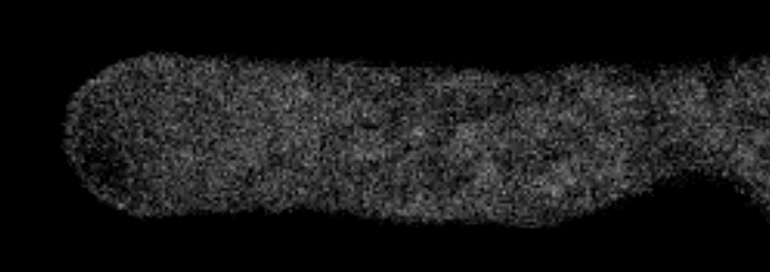
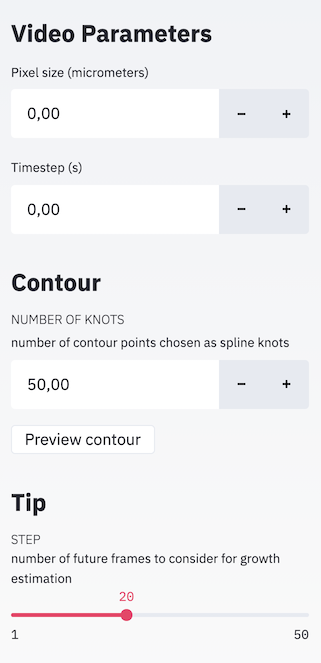

# TipQUANT

Automated tool for retrieving data, such as tip location and membrane intensity distribution, from pollen growth videos, and quantifying pollen tube growth and fluorescence intensity using contour detection.




This project is open source and developed in Python.
**Supported OS:** Windows 10/11, macOS, Linux

## Setup of the application

The installation is available for Windows 11 and MacOS (at least since the M1 version). However there are a few pre-requisites to check to make the installation smoother.

### Pre-requisites

Before installing the software, you must ensure the following tools are installed and configured correctly.

<details>
<summary><h3>Windows version</h3></summary>

<h4> 1. Python 3.11 (Strict Requirement) </h4>

* **Download:** [Python 3.11.9](https://www.python.org/downloads/release/python-3119/)
* **Critical Installation Step:** You **MUST** check the box **"Add python.exe to PATH"** at the bottom of the installer window.
* *Note:* Do not use Python 3.12 or 3.13 as they may cause dependency conflicts.

<h4> 2. FFmpeg and OpenH264 (Video Processing)</h4>

<h5> a. FFmpeg</h5>

Windows does not have FFmpeg installed by default.

1. Download the **full build** (e.g., `ffmpeg-git-full.7z` or `.zip`) from [Gyan.dev](https://www.gyan.dev/ffmpeg/builds/).
2. Extract the folder and rename it to `ffmpeg`.
3. Move it to `C:\ffmpeg`.
4. **Add to PATH (Required):**
    * Search for "Edit the system environment variables" -> "Environment Variables".
    * Under **System variables**, edit **Path**.
    * Add a new entry: `C:\ffmpeg\bin`.
    * **Restart your terminal/PowerShell** for changes to take effect.

<h5> b. OpenH264</h5>

You also need to install this codec for the application to work properly with the processing of the video on Windows.

1. Go to the Cisco OpenH264 1.8.0 [release page](https://github.com/cisco/openh264/releases/tag/v1.8.0).
2. Download the **.bz2** file related to your Windows bit version. Depending on your version it can be one of the two: `openh264-1.8.0-win32.dll.bz2` or `openh264-1.8.0-win64.dll.bz2`, usually the latter. More here about [How to tell if my Windows device is running a 32-bit or 64-bit version of Windows?](https://support.microsoft.com/en-us/windows/32-bit-and-64-bit-windows-frequently-asked-questions-c6ca9541-8dce-4d48-0415-94a3faa2e13d)
3. Extract the downloaded archive; you should obtain a file with the `.dll` extension.
4. Now you have two options:

    * **Option 1:** Copy the extracted file and paste it into your `C:\Windows\System32` folder (you will need administrator privileges). If you can't have the admin rights, check option 2.

    * **Option 2:** Keep it safe and once you'll have downloaded the TipQUANT repository (see the step [Install and Run](#install-and-run) below), copy and paste the extracted file directly into the root of the directory (besides the `run_app.py` file)

<h4> 3. Poetry (Dependency Manager) </h4>

1. Install via PowerShell:

    ```powershell
    (Invoke-WebRequest -Uri [https://install.python-poetry.org](https://install.python-poetry.org) -UseBasicParsing).Content | py -
    ```

2. If the `poetry` command is not found, add `%APPDATA%\Python\Scripts` to your User Path variable.

</details>

<details>
<summary><h3>MacOS version</h3></summary>

Make sure you have Homebrew installed. This installation requires `curl` to be installed, but it should be installed by default.

```sh
/bin/bash -c "$(curl -fsSL https://raw.githubusercontent.com/Homebrew/install/HEAD/install.sh)"
```

<h4>1. Python 3.11</h4>

On MacOS, a version of Python might be already installed but make sure you have the 3.11 installed locally. Find more on the official [Python page](https://www.python.org/downloads/release/python-3119/) and download their official installer.

<h4>2. FFMpeg (video processing)</h4>

On MacOS, just simply run the following command with our previously installed Homebrew:

```sh
brew install ffmpeg
```

<h4>3. Poetry</h4>

Following their [tutorial](https://python-poetry.org/docs/#installation), run the following command:

```sh
curl -sSL https://install.python-poetry.org | python3 -
```

</details>

### Install and Run

#### Clone the repository

Getting the code from the repository and clone or download it inside on your local machine. You will need to install Git separately if you want to clone it.

```sh
git clone [https://github.com/YourRepo/TipQUANT.git](https://github.com/YourRepo/TipQUANT.git)
cd TipQuant
```

Now to setup the Python environment use Poetry to install the required Python libraries.

<details>
<summary><h3>Windows version</h3></summary>

<h4>Install Dependencies</h4>

```powershell
# Force usage of Python 3.11
poetry env use python3.11

# Install packages
poetry install --without dev
```

*Troubleshooting:* If you see an error regarding `Microsoft Visual C++ 14.0`, please install the [Visual Studio Build Tools](https://visualstudio.microsoft.com/visual-cpp-build-tools/) ("Desktop development with C++" workload).

<h4>Run the Application</h4>

**Note for Poetry 2.0+ Users:** The `poetry shell` command is deprecated. Please use the command below to launch the application directly.

1. **Start the Application:**
    Run this command inside the `TipQUANT` directory:

    ```powershell
    poetry run python run_app.py
    ```

2. **Using the Interface:**
    The browser will open automatically at `http://localhost:8501`.
    * **Primary Video / Reference Channel:** Upload the primary video used for contour/growth detection.
    * **Secondary Video / Signal Channel:** Upload the fluorescence video for intensity measurement.

If you find any issue during the setup, please take a loot at our troubleshooting [section](#troubleshooting).

</details>

<details>
<summary><h3>MacOS version</h3></summary>

<h4>Install Dependencies</h4>

```sh
poetry install --without dev
eval $(poetry env activate)
```

<h4>Run the Application</h4>

After activating the virtual environment, run the following command:

```sh
(venv) python run_app.py
```

</details>

## How to use it?

* The side bar on the left is dedicated to user input parameters



* You can load your video(s) on the main panel. When a video is uploaded as a parallel video, the primary video is used as a reference for the contour detection. The computation of the measures are then done only once on both videos and contour detection from the primary video is applied on the second video.


* Once you have uploaded your video(s) and picked your parameters, you can click on the "Run" button, at the end of the side bar. Data will be saved locally in the path specified in the "Output directory" field (`data/output` by default).


## Model assumptions

Our model is based on two key assumptions:

* There is one only pollen tube in the video
* The pollen tube cannot grow towards multiple direction at a given time

## How does it work?

As a reminder, our work aims to automatically find the tip, defined by the point on the contour with maximal growth on the pollen tube, so that we can derive useful measurements from it.

### Code organization

From the code perspective, we have one data holder class: `PollenTube` in `src/core/model.py`, that fully describes all the characteristics (such as contour, normals, tip, ...) of a pollen tube.

A tube is instantiated "empty" (every attribute set to `None`) and is filled by the different modules in `src/core/contour.py` and `src/core/tip.py`. The modules are classes that serve only one purpose (for example, detecting the contour or fitting splines). Their attributes are the parameters of the model.

There are also modules in `src/core/region.py`, that define the measurement areas in the file. And a module for measurements, located in `src/core/measure.py`, which provides methods to compute the output of this application.

#### Notes on object representation

* A `contour` is represented by a `numpy.array` of size `n_contour_points * 2`. One key thing is that, points are sorted by adjacency in a counter-clockwise manner.
* Normals and tangents are also `numpy.array` of size `n_contour_points * 2`. Objects tied to the contour should have the same length as the contour. It is also the case for `displacements` and `curvs` (curvatures), though they are scalars so their dimension is `n_contour_points * 1`.
* Every variable mentionning `indices` is referring to the indices wrt a contour. For instance, to get the tip location from `tip_index`, we use `contour[tip_index]`.

### Main pipeline

1. We start with a list of `frames` and `config` parameters (user defined). The `config` allows us to instantiate every module.

2. For each frame:
    1. We detect the principal contour after preprocessing the frames, using the `ContourDetection` module.
    2. We fit splines to the contour using the `ContourParameterization` module; splines are useful to reduce noise in the computations of normals and tangents vectors (we could otherwise use finite differences).
    3. We compute tangents by derivating the fitted splines. Normals by rotating tangents and normalizing the result. And curvatures by taking the norm of the tangents derivatives. This is done by the `ContourCharacterization` module.
    4. We save the `contour` detected at this step to help the next contour detection: as the intensity inside the pollen tube varies, the detected contour at time `t+1` is sometimes smaller than the contour at time `t`. This is just an artifact from contour detection, so we ensure that the `contour` never decreases by computing the union of the detected contours from one step to another.
    5. We save the result of the iteration in the `PollenTube` model.

    At this point, we have, for each frame, a good contour representation as well as some of its properties like normals. We can then locate the tip by iterating over the contours and looking one step ahead. (This allow us to compute growth and the so-called tip.)

3. For each contour:
    1. We compute its region of interest (or of growth) by substracting the mask of the future contour at time `t + step` with the current mask at time `t`. This is handled by the `ContourROI` module.
    2. For each point in the region of interest, we compute its displacement, defined by the length of the intersection between its normal vector and the future contour at time `t+step` (`ContourDisplacement` module). 
    3. We compute the main growth direction as the sum of the normal vectors from the roi points weighted by their displacementn (still `ContourDisplacement` module).
    4. Finally, we locate the tip by sliding a window over the region of interest points with the `TipDetection` module. For each point in the window, we compute the dot product of its normal, weighted by the exponential 2 of its displacement, and the main growth direction, and then compute the average of all the dot products over the window. The window with the maximum value is selected and its center is defined as the tip location.
    5. We save the result of the iteration in the `PollenTube` model.

4. We run the clustering algorithm DBSCAN to detect wrongly placed tips. Wrong tips are adjusted from the valid ones. This is done using the `TipCorrection` class. The need for correction happens in some cases where there are a lot of noise around the pollen tube or if the pollen tube contour is not good enough.

    We now possess for every frames (except the last `step` ones), their contours, properties and tips. We can know perform measures.

5. For each tube:
    1. We compute the membrane area by extending an arc of user-defined length and width around the tip with the `Membrane` module.
    2. We compute the region of measurement inside the cytoplasm (non-overlapping with the membrane) with the `Region <A, C or D>` module.
    3. We use the `Measure` module to compute useful figures from the masks above. A list of the measurements is described below. 

6. We save the results and return them to the user.

## Parameters description

Here we will describe every parameters of the model, though some are more sensitive than others (see next section).

### Video parameters (mandatory)

* **pixel size**: the size of one pixel in micrometers
* **timestep**: the time delta between two frames in seconds

### Contour detection

* **kernel size**: the size of the kernel used for preprocessing operations (gaussian blur, dilation and erosion) of the original frames
* **sigma**: the standard deviation used in the gaussian blur
* **gamma**: the gamma coefficient used in the gamma correction filter in preprocessing

### Splines

* **number of knots**: number of contour points that will be considered as knot points. A float
value between 0 and 1 corresponds to a percentage of the number of points in the contour; or an
integer that will be the number of knots
* **degree** : splines degree

### Tip detection

* **window size**: size of the window used to average contour points characteristics to find the tip. Larger values will cancel noise but will not detect well very localized growth.
* **step**: number of frames used to look in the future, this is used to determine growth direction. Fast changing videos require a lesser step.

### Tip correction

Below parameters express the expected number of tips around a given tip. As the pollen tube grows, the tip is supposed to move relatively smoothly from one frame to another. Thus, if we look at the full picture (all the detected tips on the 2D plane), we expect a "chain" of tips. For one particular tip, the previous ones and next ones should be close, depending on the speed of growth.

* **epsilon**: distance (um) to look from one tip for its neighbours
* **samples**: number of tips expected in the epsilon distance

### Membrane

* **length**: length of the membrane in micrometers
* **thickness**: thickness of the membrane in pixel units

### Cytoplasm region

* **type**: shape of the measurement region
* **length**: length of the region
* **depth (for type A)**: depth of the "V" shape from the extremity of the membrane
* **depth (for type D)**: depth of the center of the circle
* **radius (for type D)**: radius of the circle

## How to choose parameters?

We expose only the most important parameters to the user so that it's easier for him to choose them. Some of them like **timestep** and **pixel size** are fixed when recording the video, but others might need some consideration from the user like **step** or **window size**, which depend on how fast the pollen tube grows or how large it is.
Cytoplasm region parameters are entirely up to the user's convenience and can be changed freely, although their default values still ensure good measures. We will discuss the parameters that affect the finding of the tip as finding the right tip is the basis for having good measurements.

### Spline knots

To find the tip of the pollen tube, which defines the measurement area, our model heavily relies on the computation of tangents and normals of the pollen tube.

As tangents and normals are derived from the contour shape, it is crucial to have a denoised shape, which is controlled by the fitting of splines to the contour.

The number of contour points to be considered as knots points, **spline knots**, needs to be carefully picked. Choosing a small number of knots tends to smooth the contour spline but if a small number of knots does not work (because the shape is too noisy or irregular), consider increasing it.

### Step parameter

To locate the tip, we first define a region of interest where we are looking for the tip. This is done by looking at the difference between the current frame and one frame in the future.
We assume that the pollen tube has been growing between those frames and we are now able to locate the region of interest.

The parameter to look for is **step**, which is the number of frames in the future that we use for comparison.

You may want to adapt this parameter according to *how fast* the pollen tube is growing in the video. Picking a small step is suited for fast growing pollen tube videos.

## Output description

Here we will list the outputs of the application (the output directory is by default `tmp`, however you can set it to your convenience):

* **video.mp4**: a video showing the tip and measurement region on top of the original video
* **membrane_xs.csv**: an array of size `N * 1` containing the curvilinear abscissa used for membrane measurements (measurements were interpolated to fit on this abscissa so that we can compare measurements along the membrane between frames)
* **membrane_curvs.csv**: an array of size `(n_frames - step) * N` containing the curvatures of the membrane at each point on the curvilinear abscissa
* **membrane_intensities.csv**: an array of size `(n_frames - step) * N` containing the intensities of the membrane at each point on the curvilinear abscissa
* **normals.npy**: an array of array of size `(n_frames - step)` where each array contains the normals vectors of the membrane at each point on the curvilinear abscissa at a frame
* **contours.npy**: an array of array of size `(n_frames - step)` where each array contains the contour of the tube at a frame
* **displacements.npy**: an array of array of size `(n_frames - step)` where each array contains the displacement of the membrane at each point on the curvilinear abscissa at a frame
* **data.csv**: dataframe with `n_frames - step` rows containing the following columns:
  * area_growth: area of the difference between the pollen tube at step `t` and the pollen tube at step `t + 1`
  * cytoplasm_intensity_mean: mean intensity inside the mask defined by region (only C)
  * tip_size: the size of the tip defined by the distance between its two extremities
  * growth_vec_x,y: the x, y coordinates of the main growth direction at step `t` (computed from `t` to `t + step` with step defined by the parameter `tip.step`)
  * tip_x,y: the x, y coordinates of the tip
  * growth_from_direction: this is the distance between the tip at step `t` and the contour at step `t + step`, following the main growth direction (i.e. we project the tip along the main growth direction towards the next contour)
  * growth_from_tip: the distance between the tip at step `t` and the tip at step `t + step`
  * growth_direction_angle: angle of the growth vector compared to the first growth vector
  * time: the time scale (number of frame or ms)
  
  

Additionnaly, the GUI provides a few plots for convenience, namely:

* Line plot of plasma membrane mean intensity with respect to time
* Line plot of cytoplasm mean intensity with respect to time
* Line plot of area growth with respect to time
* A heatmap with time as x, curvilinear abscissa as y and intensity as color from the membrane measures (made from the data in **membrane_intensities.csv** wrt **membrane_xs.csv**)

# Troubleshooting

**Q: `ffmpeg` is not recognized as an internal or external command.**
**A:** You did not add `C:\ffmpeg\bin` to your System Environment Variables (Path), or you did not restart your terminal after doing so.

**Q: `poetry: The term 'poetry' is not recognized...`**
**A:** Add `%APPDATA%\Python\Scripts` to your User Environment Variables (Path).

**Q: `The command 'shell' is not installed...`**
**A:** You are using Poetry 2.0. Do not use `poetry shell`. Instead, preface your commands with `poetry run...`.

**Q: `ModuleNotFoundError: No module named 'streamlit'`**
**A:** You are running standard python instead of the virtual environment. Use `poetry run python run_app.py`.
